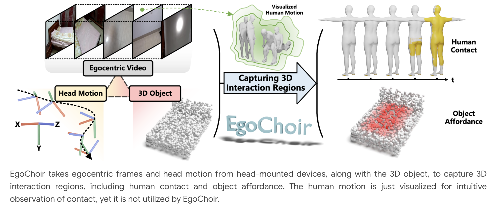

[](https://yyvhang.github.io/EgoChoir/)
[](https://arxiv.org/abs/2405.13659)
# EgoChoir: Capturing 3D Human-Object Interaction Regions from Egocentric Views (NeurIPS 2024)
PyTorch implementation of **EgoChoir: Capturing 3D Human-Object Interaction Regions from Egocentric Views**.

## 📖 To Do List
1. - [x] release the training, evaluation, and inference code.
2. - [x] release the pretrained checkpoint.
3. - [x] release the collected dataset.

## 📋 Table of content
 1. [❗ Overview](#1)
 2. [💡 Requirements](#2)
 3. [📖 Dataset](#3)
 4. [✏️ Usage](#4)
    1. [Environment](#41)
    2. [Train](#42)
    3. [Evaluation](#43)
    4. [Inference](#44)
 5.  [✉️ Statement](#5)
 6.  [🔍 Citation](#6)

## ❗Overview <a name="1"></a> 
EgoChoir seek to estimate 3D human contact and obejct affordance from egocentric videos:
<p align="center">
     <br />
    <em> 
    </em>
</p>

## 💡Requirements <a name="2"></a>  
(1) Download the [`smpl_neutral_geodesic_dist.npy`](https://rich.is.tue.mpg.de/download.php) and put it under the folder `data/`, this is used to compute the metrics geo. We also make the `smplx_neutral_geodesic_dist.npy`, download [here](https://pan.baidu.com/s/1R-nM72cuKPg8g_zhxdRkwQ?pwd=233w). 
<br>
(2) Download the pre-trained [HRNet](https://datarelease.blob.core.windows.net/metro/models/hrnetv2_w40_imagenet_pretrained.pth), put `.pth` file under the folder `tools/models/hrnet/config/hrnet/`. <br>
(3) Download the pre-trained EgoChoir from [Baidu Pan](https://pan.baidu.com/s/1Y09cWXF2EwT9h-HrcSPiIQ?pwd=grru), key: grru, or [Google Drive](https://drive.google.com/drive/folders/1DzEhqTeZnrquXTRvJvVHNBFLCtT_ieDA?usp=sharing). Put the checkpoint file under the folder `runs/`. <br>files under the `runs/`. Note: We have integrated the weights of the motion encoder into the checkpoint, you don't need to pre-train it.

## 📖Dataset <a name="3"></a>

The released dataset includes the following data: <br>
(1) video clips from [GIMO](https://github.com/y-zheng18/GIMO) and [EgoExo-4D](https://ego-exo4d-data.org/). <br>
(2) 3D human contact sequence. <br>
(3) 3D objects with affordance annoatation. <br>
(4) Head motion sequence. <br>

Download the dataset from [Baidu Pan](https://pan.baidu.com/s/1amY7K_bl4qo-mhzZa2ZGbA?pwd=2zjt), key: 2zjt, around 110G. We will upload the date to other storage spaces for downloading without a Baidu account.

## ✏️ Usage <a name="4"></a>
### Environment <a name="41"></a> 
First clone this respository and create a conda environment, as follows:
```bash  
git clone https://github.com/yyvhang/EgoChoir_release.git
cd EgoChoir_release
conda create -n egochoir python=3.10 -y
conda activate egochoir
#install pytorch 2.0.1
conda install pytorch==2.0.1 torchvision==0.15.2 torchaudio==2.0.2 pytorch-cuda=11.8 -c pytorch -c nvidia
```
Then, install the other dependancies:
```bash  
pip install -r requirements.txt
```

### Train <a name="42"></a>
If you want to train EgoChoir, please run the following command, you could modify the parameter at `configs/EgoChoir.yaml`.
```bash  
bash run.sh
```

### Evaluation  <a name="43"></a>
Run the following command to evaluate the model.
```bash  
python eval.py --config config/EgoChoir.yaml --use_gpu True --train_device single
```

### Inference  <a name="44"></a>
Run the following command to infer the results, including the sampled frames and the whole sequence.
```bash  
python infer.py --config config/EgoChoir.yaml --use_gpu True --train_device single
```

## ✉️ Statement
This project is for research purpose only, please contact us for the licence of commercial use. For any other questions please contact [yyuhang@mail.ustc.edu.cn](yyuhang@mail.ustc.edu.cn).

## 🔍 Citation

```
@article{yang2024egochoir,
  title={EgoChoir: Capturing 3D Human-Object Interaction Regions from Egocentric Views},
  author={Yang, Yuhang and Zhai, Wei and Wang, Chengfeng and Yu, Chengjun and Cao, Yang and Zha, Zheng-Jun},
  journal={arXiv preprint arXiv:2405.13659},
  year={2024}
}
```